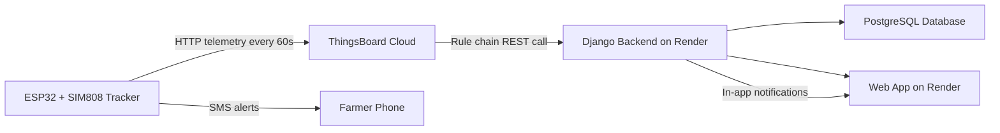

# Livestock GPS Tracking System — User Manual

**Version 1.0 · June 2026**

This manual covers the full system: hardware (ESP32 + SIM808), cloud setup (ThingsBoard + Render), and the web application for farmers.

---

## Table of Contents

1. [System Overview](#1-system-overview)
2. [What You Need](#2-what-you-need)
3. [Hardware Setup (ESP32 + SIM808)](#3-hardware-setup-esp32--sim808)
4. [Tracker Firmware](#4-tracker-firmware)
5. [ThingsBoard Setup](#5-thingsboard-setup)
6. [Render Deployment (Cloud)](#6-render-deployment-cloud)
7. [Registering Animals & Devices](#7-registering-animals--devices)
8. [Geofences](#8-geofences)
9. [Web Application Guide](#9-web-application-guide)
10. [Notifications & Alerts](#10-notifications--alerts)
11. [Testing & Troubleshooting](#11-testing--troubleshooting)
12. [API Reference](#12-api-reference)
13. [Related Documents](#13-related-documents)

---

## 1. System Overview

The system tracks livestock in real time using a GPS collar/tag device, sends location data over the mobile network, and displays positions on a web map.

### How data flows



| Component | Role |
|-----------|------|
| **ESP32 + SIM808** | Reads GPS, posts telemetry, sends SMS geofence/offline alerts |
| **ThingsBoard** | IoT platform; receives device data and forwards it to your server |
| **Django backend** | Stores locations, geofences, devices; serves the REST API |
| **React frontend** | Map, dashboard, animal profiles, notifications |
| **Econet SIM** | Mobile data (GPRS) and SMS |

### Live URLs (production)

| Service | URL |
|---------|-----|
| Web app (farmers) | https://high-tech-sherperd.onrender.com |
| Backend API | https://livestock-tracking-system.onrender.com |
| Django admin | https://livestock-tracking-system.onrender.com/api/admin/ |

---

## 2. What You Need

### Hardware

| Item | Notes |
|------|-------|
| ESP32 development board | Main microcontroller (replaces Arduino Uno in older docs) |
| SIM808 module | Combined GPS + GSM/GPRS |
| GPS antenna | Connected to SIM808 |
| GSM antenna | Connected to SIM808 |
| Active buzzer + 220 Ω resistor | Optional alarm (GPIO 25) |
| Econet SIM card | Data bundle + airtime for SMS |
| Power supply | 5 V / 2 A minimum for SIM808 during transmission |
| Jumper wires & breadboard | Prototyping |

> **Power tip:** For bench testing you can power the ESP32 from USB and the SIM808 from a separate 5 V phone charger. Both **GND** lines must be connected together. See `LAPTOP_USB_POWER_GUIDE.md` and `BEGINNER_POWER_SETUP_GUIDE.md` for details.

### Software & accounts

| Item | Purpose |
|------|---------|
| Arduino IDE | Upload firmware to ESP32 |
| ThingsBoard Cloud account | https://eu.thingsboard.cloud (or your region) |
| Render account | Host backend + frontend |
| GitHub (optional) | Connect repo to Render for auto-deploy |

### Libraries (Arduino IDE)

Install via **Sketch → Include Library → Manage Libraries**:

- No external GPS library required — firmware parses NMEA directly from SIM808

Board support: **ESP32 by Espressif** (Board Manager URL: `https://raw.githubusercontent.com/espressif/arduino-esp32/gh-pages/package_esp32_index.json`)

---

## 3. Hardware Setup (ESP32 + SIM808)

### Pin connections

```
ESP32 GPIO 16  →  SIM808 TX
ESP32 GPIO 17  →  SIM808 RX
ESP32 GPIO 25  →  [220 Ω] → Buzzer (+)
ESP32 GND      →  SIM808 GND  (required — common ground)
SIM808 VCC     →  5 V / 2 A power supply (NOT from ESP32 3.3 V)
ESP32          →  USB (programming + power)
```

> **Important:** SIM808 TX connects to ESP32 RX (pin 16) and SIM808 RX to ESP32 TX (pin 17).

ASCII diagram: see `HARDWARE_WIRING_DIAGRAM.txt` (adapt pin numbers from Arduino Uno to ESP32 as above).

### SIM card preparation

1. Insert SIM in a phone and confirm it works.
2. Disable PIN lock on the SIM.
3. Ensure data bundle and airtime are active.
4. Note the SIM phone number — you will enter it in Django admin.

### Antennas

- Attach GPS antenna before expecting a fix (outdoors or near a window).
- Attach GSM antenna before network registration.
- First GPS fix can take 1–5 minutes cold start.

---

## 4. Tracker Firmware

**File:** `arduino_tracker/livestock_gps_tracker.ino` (or `trackerv2.ino`)

### Settings to change before upload

Open the `.ino` file and edit the **SETTINGS** block at the top:

```cpp
const char *APN = "econet.net";           // Econet APN
const char *DEVICE_ID = "GPS001";         // Must match Django admin device ID
const char *TB_URL = "http://<host>/api/v1/<ACCESS_TOKEN>/telemetry";
const char *ALERT_PHONE = "+263XXXXXXXXX"; // Your alert SMS number

const unsigned long SEND_INTERVAL_MS = 60000UL;  // Post every 60 seconds

// Device-side geofence (independent of admin — see Section 8)
const double GEOFENCE_LAT      = -20.168522;
const double GEOFENCE_LNG      =  28.643799;
const double GEOFENCE_RADIUS_M = 10.0;
```

| Setting | Description |
|---------|-------------|
| `APN` | `econet.net` for Econet Zimbabwe |
| `DEVICE_ID` | Unique ID — must exist in Django admin as `GPS001` etc. |
| `TB_URL` | ThingsBoard device access token URL |
| `ALERT_PHONE` | Number that receives SMS geofence/offline alerts |
| `GEOFENCE_*` | Local SMS geofence — separate from admin geofence |

### Upload steps

1. Connect ESP32 via USB.
2. **Tools → Board → ESP32 Dev Module** (or your exact board).
3. **Tools → Port →** select COM port.
4. Open `livestock_gps_tracker.ino`.
5. Click **Upload**.
6. Open **Serial Monitor** at **115200 baud**.

### Expected serial output (healthy device)

```
INIT
AT OK
Network registered
GPS FIX
LAT: -20.168022
LON: 28.641632
POST OK
```

### Telemetry JSON sent every 60 s

```json
{
  "device_id": "GPS001",
  "latitude": -20.168022,
  "longitude": 28.641632,
  "speed": 0.0,
  "heading": 65,
  "battery_level": 64
}
```

### Device features

| Feature | How it works |
|---------|--------------|
| Location posting | HTTP POST to ThingsBoard every 60 s |
| Geofence SMS | Device checks hardcoded fence; SMS if outside (10 min cooldown) |
| Offline SMS | After 3 failed HTTP posts, sends offline alert SMS |
| Buzzer | Responds to SMS command `BUZZER_ON` (10 s beep) |
| Boot test | 2 s buzzer beep on startup confirms wiring |

---

## 5. ThingsBoard Setup

ThingsBoard receives telemetry from the tracker and forwards it to your Django backend.

### Step 1 — Create a device

1. Log in to https://eu.thingsboard.cloud
2. **Entities → Devices → Add device**
3. Name: `GPS001` (must match `DEVICE_ID` in firmware)
4. Device profile: default
5. Open the device → **Copy access token**
6. Build telemetry URL:

```
http://eu.thingsboard.cloud/api/v1/YOUR_ACCESS_TOKEN/telemetry
```

Paste this into `TB_URL` in the firmware.

### Step 2 — Create a rule chain (forward to Render)

1. **Rule chains → Root Rule Chain** (or create new chain)
2. Add node: **Action → REST API Call**
3. Configure:

| Field | Value |
|-------|-------|
| Method | `POST` |
| URL | `https://livestock-tracking-system.onrender.com/api/tracking/update_location/` |
| Headers | `Content-Type: application/json` |
| Body | See below |

**Request body template:**

```json
{
  "device_id": "${deviceName}",
  "latitude": "${latitude}",
  "longitude": "${longitude}",
  "speed": "${speed}",
  "heading": "${heading}",
  "battery_level": "${battery_level}"
}
```

4. Connect: **Message Type Switch** (or **Save Timeseries**) → **REST API Call**
5. Save and activate.

> **Critical:** Use the **backend** URL (`livestock-tracking-system.onrender.com`), not the frontend (`high-tech-sherperd.onrender.com`).

### Step 3 — Verify in ThingsBoard

- Open device **Latest telemetry** — you should see latitude, longitude, etc.
- Check Render backend logs — should show `POST /api/tracking/update_location/` with **200** or **201**, not **404**.

---

## 6. Render Deployment (Cloud)

You run **two** services on Render: backend (Django) and frontend (React).

### Backend service

| Setting | Value |
|---------|-------|
| Root directory | `backend` |
| Build command | `./build.sh` |
| Start command | `gunicorn livestock_tracking.wsgi:application` |
| Environment | Python 3 |

**Required environment variables:**

| Variable | Example | Purpose |
|----------|---------|---------|
| `SECRET_KEY` | long random string | Django secret |
| `DATABASE_URL` | (from Render Postgres) | Production database |
| `RENDER` | `true` | Enables production mode |
| `DJANGO_SUPERUSER_USERNAME` | `admin` | Auto-created admin user |
| `DJANGO_SUPERUSER_EMAIL` | `you@email.com` | Admin email |
| `DJANGO_SUPERUSER_PASSWORD` | strong password | Admin password |

`build.sh` automatically runs: `pip install` → `collectstatic` → `migrate` → `create_admin.py`.

### Frontend service

| Setting | Value |
|---------|-------|
| Root directory | `frontend` |
| Build command | `npm install && npm run build` |
| Publish directory | `build` |
| Environment variable | `REACT_APP_API_URL=https://livestock-tracking-system.onrender.com` |

### After deploy

1. Open admin: https://livestock-tracking-system.onrender.com/api/admin/
2. Log in with superuser credentials.
3. Register animal + GPS device (Section 7).
4. Open web app: https://high-tech-sherperd.onrender.com
5. Register a farmer account or use admin-created user.

---

## 7. Registering Animals & Devices

**Every tracker must be registered before location posts succeed.**

### Option A — Django admin (recommended for production)

1. Go to https://livestock-tracking-system.onrender.com/api/admin/
2. **Animals → Add animal**
   - ID: e.g. `0001`
   - Name, breed, gender, birth date, owner (your user account)
3. **GPS Devices → Add GPS device**
   - Device ID: `GPS001` (exact match to firmware)
   - Animal: select the animal above
   - IMEI: from serial monitor (`AT+GSN` → e.g. `865067025786099`)
   - Phone number: SIM card number

### Option B — Local script (development)

```bash
cd backend
python create_tracker_device.py
```

Follow the prompts for username, animal, device ID, IMEI, and phone.

### Option C — Test data script

```bash
cd backend
python create_test_user.py
```

Creates a test user and `GPS001` device for local testing.

---

## 8. Geofences

There are **two independent** geofence systems. They do not sync automatically.

| Source | Where configured | Alert type |
|--------|------------------|------------|
| **Django admin** | Admin → Geofences | In-app notification on web |
| **Device firmware** | `GEOFENCE_LAT/LNG/RADIUS` in `.ino` | SMS to `ALERT_PHONE` |

### Admin geofence (web alerts)

1. Admin → **Geofences → Add geofence**
2. Select animal, name, center lat/lng, radius (metres)
3. Check **Is active**
4. **Deactivate or delete old geofences** — only one active fence per animal is recommended

Backend behaviour:

- Map shows the **newest** active geofence as a green/red circle
- Alerts fire only when the animal **crosses from inside to outside** (not every ping)
- 30-minute cooldown between repeat alerts for the same fence

### Device geofence (SMS alerts)

Edit in firmware and re-upload:

```cpp
const double GEOFENCE_LAT      = -20.168522;
const double GEOFENCE_LNG      =  28.643799;
const double GEOFENCE_RADIUS_M = 10.0;
```

Serial monitor shows: `GEOFENCE DIST (m): 12.3` — distance from fence center.

### Best practice

- Set **the same coordinates** in admin and firmware, **or**
- Use admin only for web alerts and comment out `checkGeofenceAndAlert()` in firmware to avoid duplicate SMS

---

## 9. Web Application Guide

**URL:** https://high-tech-sherperd.onrender.com

### Login & account

- Register or log in with your username and password.
- **Account** page: update profile details.

### Dashboard (`/`)

- Overview of your herd: animal count, online/offline devices, recent activity.
- Click an animal card to open its detail page.

### Animals (`/animals`)

- List all registered animals.
- **Add Animal** — create a new profile (ID, name, breed, gender, etc.).
- Click an animal to view details.

### Animal detail (`/animals/:id`)

| Section | Information |
|---------|-------------|
| Profile | Name, breed, gender, weight, photo |
| GPS device | Device ID, IMEI, phone, battery, last seen, status |
| Current location | Latest latitude/longitude, speed, heading |
| Location history | Filter by date range; newest entries at top |
| Map link | Jump to map centred on this animal |

Use **Refresh** on history to load new points (auto-polling is off by default).

### Map (`/map`)

| Feature | How to use |
|---------|------------|
| Animal markers | One pin per tracked animal; red = geofence breach |
| Geofence circle | Green = inside; red = outside |
| 24 h trail | Polyline showing recent movement |
| Live update | Toggle **Live update (10s)** for automatic refresh |
| Manual refresh | Click refresh button anytime |
| Map type | Switch standard / satellite view |
| Popup | Click marker for coords, speed, battery, timestamp |

### Notifications (`/notifications`)

- View geofence breaches, low battery, offline alerts.
- Filter by type; mark as read.
- Unread count shown in navbar.

### Settings (`/settings`)

Configure notification preferences:

- Email / SMS / push toggles per alert type
- Geofence breach, low battery, device offline

---

## 10. Notifications & Alerts

| Alert | Trigger | Channel |
|-------|---------|---------|
| Geofence breach (web) | Animal leaves admin geofence | In-app notification |
| Geofence breach (SMS) | Animal leaves firmware geofence | SMS to `ALERT_PHONE` |
| Device offline (SMS) | 3 consecutive HTTP failures | SMS to `ALERT_PHONE` |
| Low battery | Battery below 20% on POST | Device status + notification |
| Buzzer | SMS `BUZZER_ON` to device SIM | Physical buzzer 10 s |

---

## 11. Testing & Troubleshooting

### Test location endpoint manually

PowerShell:

```powershell
$body = '{"device_id":"GPS001","latitude":-20.168,"longitude":28.641,"battery_level":80}'
Invoke-WebRequest -Uri "https://livestock-tracking-system.onrender.com/api/tracking/update_location/" `
  -Method POST -Body $body -ContentType "application/json"
```

Expected: **201** with `"Location updated successfully"`.

### Common problems

| Symptom | Likely cause | Fix |
|---------|--------------|-----|
| `404 Not Found` on update_location | Device not registered in admin | Add GPS device with matching `device_id` |
| `404` with `"GPS device not found"` | Same as above | Register `GPS001` in admin |
| Map not updating | Live mode off | Enable **Live update** or click refresh |
| Old geofence in alerts | Multiple active geofences | Deactivate old fences in admin |
| SMS geofence but web OK | Firmware fence differs from admin | Align coordinates or disable device fence |
| `HTTP CODE: 603` on device | DNS/GPRS failure | Check APN, signal, data bundle; try IP fallback |
| `HTTP CODE: 601` | Network error | Reset bearer; check antenna and signal |
| No GPS fix | Indoors / no antenna | Move outdoors; wait 2–5 min |
| ThingsBoard OK, Render 404 | Wrong Render URL in rule | Use backend URL, not frontend |
| Admin page unstyled | Static files | Ensure `build.sh` runs `collectstatic` |

### Serial monitor checklist

```
✓ AT communication OK
✓ SIM registered (CREG: 0,1 or 0,5)
✓ GPRS bearer up (+SAPBR: 1,1,"10.x.x.x")
✓ GPS fix (valid lat/lng)
✓ POST OK
```

### Verify API responses

Open in browser (while logged in or for public endpoints):

- Current locations:  
  `https://livestock-tracking-system.onrender.com/api/tracking/locations/current_locations/`
- Animal detail:  
  `https://livestock-tracking-system.onrender.com/api/tracking/animals/0001/`

---

## 12. API Reference

### Location update (devices / ThingsBoard)

```
POST /api/tracking/update_location/
Content-Type: application/json
Auth: none required
```

**Body:**

```json
{
  "device_id": "GPS001",
  "latitude": -20.168022,
  "longitude": 28.641632,
  "speed": 0.0,
  "heading": 65,
  "battery_level": 64,
  "timestamp": "2026-06-06T15:30:00Z"
}
```

Also accepts `deviceName` (ThingsBoard) or `imei` instead of `device_id`.

### Key authenticated endpoints (farmer login required)

| Method | Endpoint | Purpose |
|--------|----------|---------|
| GET | `/api/tracking/animals/` | List animals |
| GET | `/api/tracking/animals/{id}/` | Animal detail + last location |
| GET | `/api/tracking/animals/{id}/location_history/` | Historical points |
| GET | `/api/tracking/locations/current_locations/` | All current positions |
| GET | `/api/notifications/notifications/` | Alert list |
| POST | `/api/auth/login/` | Login |
| POST | `/api/auth/register/` | Register |

Full list: see `README.md`.

---

## 13. Related Documents

| Document | Use when |
|----------|----------|
| `README.md` | Developer setup, full API list |
| `PROJECT_OVERVIEW.md` | Architecture summary |
| `QUICK_START_CHECKLIST.md` | Printable build checklist |
| `QUICK_REFERENCE_CARD.md` | Pin diagram & AT commands |
| `ARDUINO_GPS_TRACKER_BUILD_GUIDE.md` | Deep hardware/firmware guide (Arduino Uno version) |
| `GPS_TRACKER_TESTING_GUIDE.md` | Local API testing with curl |
| `HARDWARE_WIRING_DIAGRAM.txt` | ASCII wiring layout |
| `LAPTOP_USB_POWER_GUIDE.md` | USB-only bench power |
| `BEGINNER_POWER_SETUP_GUIDE.md` | Phone charger for SIM808 |

---

## Quick reference card

```
┌─────────────────────────────────────────────────────────────┐
│  LIVESTOCK GPS TRACKING — QUICK REFERENCE                   │
├─────────────────────────────────────────────────────────────┤
│  Web app:    https://high-tech-sherperd.onrender.com        │
│  Admin:      .../api/admin/                                 │
│  API:        .../api/tracking/update_location/              │
├─────────────────────────────────────────────────────────────┤
│  ESP32 RX=16  TX=17  Buzzer=25  GND common with SIM808      │
│  APN: econet.net   Post interval: 60 s                      │
├─────────────────────────────────────────────────────────────┤
│  Before first post: register GPS001 in admin                │
│  ThingsBoard device name must match DEVICE_ID                │
│  One active geofence per animal in admin                      │
└─────────────────────────────────────────────────────────────┘
```

---

*High Tech Sherperd · Livestock Tracking System · Final Year Project*
